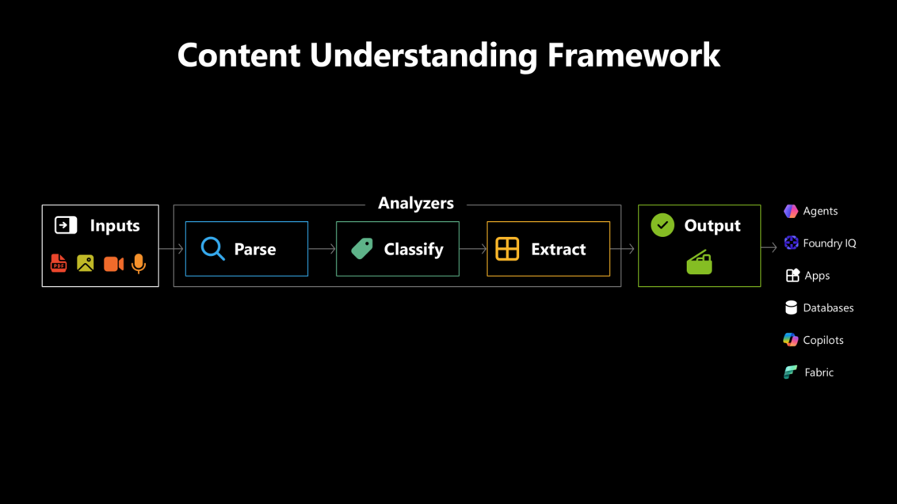

# 📄 Azure Content Understanding in Foundry Tools

> One pipeline for messy, multimodal content — **Parse → Classify → Extract** — that turns PDFs, images, audio, video, emails, and Office documents into clean, structured, agent-ready output.

## Contents

- [Why Content Understanding exists](#why-content-understanding-exists)
- [Built on the foundation of Document Intelligence](#built-on-the-foundation-of-document-intelligence)
- [The Content Understanding framework](#the-content-understanding-framework-parse--classify--extract)
- [Analyzers — the heart of Content Understanding](#analyzers--the-heart-of-content-understanding)
- [One pipeline, every modality](#one-pipeline-every-modality)
- [Try it](#try-it)
- [Where Content Understanding shows up at Microsoft](#where-content-understanding-shows-up-at-microsoft)
- [Customer stories](#customer-stories)
- [Learn more](#learn-more)

---

## Why Content Understanding exists

Real-world agentsdon't just work with clean APIs and neatly structured data. They deal with **PDFs, emails, Office documents, images, audio, and video** — the messy, unstructured content of everyday knowledge work. This is where many agents **start to break**:

- Throw raw content at an LLM and **costs go up fast.**
- Agents scramble — writing custom code, or passing **hundreds of fragments and images** into the model.
- They **misread tables, skip figures, lose context** — and slow everything down.

The result is predictable: **token usage spikes, latency climbs, reliability drops.** Critical information gets missed. Agents get confused.

**Content Understanding** is the answer. It takes messy, multimodal content and turns it into clean, structured, **agent-ready output** — three core operations (**Parse, Classify, Extract**) producing structured **markdown and JSON** downstream systems can actually work with, whether that's an agent, an app, or traditional code. Instead of forcing the model to reason over raw bytes, you hand it **structured, grounded inputs it can act on**.

---

## Built on the foundation of Document Intelligence

Content Understanding is **not** a new-from-scratch service. It brings together **Azure Document Intelligence** — Microsoft's industry-leading OCR, layout, and table-extraction technology, refined over many years — and extends it with **LLM-powered multimodal capabilities** across audio, video, and image.

| | Azure Document Intelligence | Azure Content Understanding |
|---|---|---|
| **Modalities** | Documents (PDF, images of docs) | Documents **+ audio + video + image** |
| **Output** | Layout, key-value pairs, tables | **Schema-driven JSON + markdown**, with confidence + grounding |
| **Customization** | Custom models (form/document) | **Custom analyzers + classifiers + labeling**, plus prebuilt analyzers |
| **Status** | **GA** — still fully supported | **GA** since Ignite; the recommended starting point for new content-to-JSON projects |

**Migration story:** Document Intelligence stays **GA — no forced migration**. If you have Document Intelligence in production today, keep running it. For **new** projects that need schema-driven extraction — especially across more than one modality — start with Content Understanding. Under the hood you're still getting the same proven OCR/layout/table technology that powers Document Intelligence; Content Understanding just wraps it in a single schema-driven API and adds multimodal reach.

---

## The Content Understanding framework (Parse → Classify → Extract)

At a high level, Content Understanding is **one pipeline that works across many different file types.** Take content from almost any source and run it through:

1. **Parse** — create a structured representation of the content.
2. **Classify** — identify what the content is and how it should be segmented.
3. **Extract** — pull out the fields, entities, and schema you care about.

Under the hood: specialized AI models from Document Intelligence — **OCR, layout, transcription** — plus generative models like **GPT-4.1, GPT-4.5, GPT-5.2** (more GPT-5 family models on the roadmap). The pipeline is consistent, but the **processing is tailored to the file type.** A contract isn't handled like a video. An image isn't handled like an email.

At GA, you can plug in your own **Foundry model deployments** — model choice, deployment type, and PTU-based cost controls.

## Analyzers — the heart of Content Understanding

- **Analyzers are the heart of Content Understanding** — prebuilt or custom AI pipelines specialized for a task or document type.
- Always the same shape: **Parse → Classify → Extract.**
- **Consistent. Repeatable. Composable** — across thousands of files.

Content Understanding ships a growing library of **prebuilt analyzers** (Layout, Invoice, Receipt, Contract, Call center audio, and more), and you can build **custom analyzers** in Content Understanding Studio for the document types that matter to your business — with a **Suggest schema** button that proposes a starting schema from a sample doc.

---

## One pipeline, every modality

Same Parse → Classify → Extract pipeline. **Implementation optimized per modality:**

- **Documents (e.g. a contract):** Parse uses **read and layout** to extract headings, tables, figures, structure. Classify breaks the file into meaningful parts — body, appendix, supporting material. Extract applies prebuilt or custom schemas with **confidence scores and grounding**.
- **Video:** transcripts, frames, **scene changes, semantic segmentation.**
- **Audio:** speech and transcription, with **speaker diarization, entities, action items.**
- **Images:** visual understanding — and, when relevant, the image's **role inside a larger document.**

---

## Try it

The fastest way to experience Azure Content Understanding is the **Foundry Playground** (zero-code prebuilts) → graduating to **Content Understanding Studio** when you need to customize, label, or add video/image.

📘 **[Try Azure Content Understanding in Foundry quickstart →](try-in-foundry.md)**

That guide covers:

- Pre-reqs (Foundry project, region, GPT-4.1 deployment)
- Quickstart part 1 — Foundry Playground (Layout → Invoice → Call center audio)
- Quickstart part 2 — Customize in Content Understanding Studio (custom analyzer, Suggest schema, classifier)
- How to hook Content Understanding into an agent (Microsoft Agent Framework, LangChain, MarkItDown, Logic Apps MCP)
- Current experience notes and FAQ

---

## Where Content Understanding shows up at Microsoft

Content Understanding has been GA since Ignite and is the **foundational content extraction engine** behind several Microsoft products:

- **Foundry IQ** — every knowledge source with `contentExtractionMode = "standard"` calls Content Understanding for chunking, extraction, and image verbalization.
- **Microsoft 365 Copilot** — uses Content Understanding to process attachments.
- **Deep integrations** with the **Microsoft Agent Framework**, **LangChain**, markdown-based workflows, and open-source tooling like **MarkItDown**.

---

## Customer stories

- **Wolters Kluwer** — powers **tax processing workflows in CCH Axcess Tax**. Content Understanding processes tax forms, financial documents, and supporting materials on the way in and converts them into structured outputs that drive automation reliably, at scale.
- **DataSnipper** — their **AI extraction capability** for financial professionals is powered by Content Understanding under the hood. The result: faster reviews, more reliable evidence, more trustworthy AI.

---

## Learn more

- [Content Understanding overview (Microsoft Learn)](https://learn.microsoft.com/azure/ai-services/content-understanding/overview)
- [Content Understanding Studio](https://contentunderstanding.ai.azure.com/)
- [Content Understanding Build 2026 blog](https://aka.ms/content-understanding-build2026)
- [Content Understanding Agent Framework provider on PyPI](https://pypi.org/project/agent-framework-azure-contentunderstanding/)
- [Azure Document Intelligence overview](https://learn.microsoft.com/azure/ai-services/document-intelligence/overview) — the foundation Content Understanding builds on
