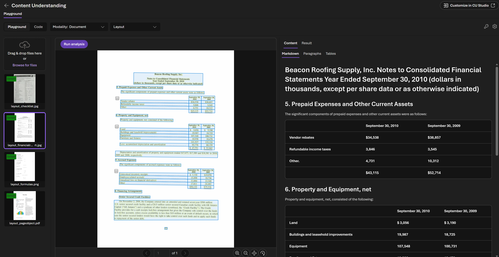
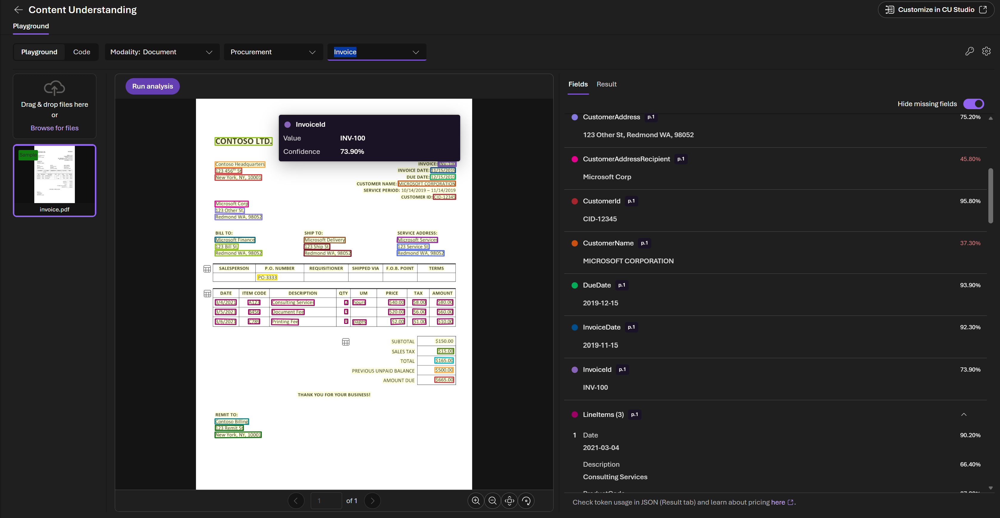
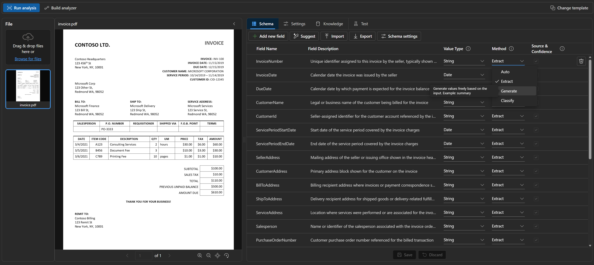

# Try Azure Content Understanding in Foundry Tools quickstart

> A ~5-minute quickstart: start in the **Foundry Playground** (prebuilt analyzers, zero code) and continue in **Content Understanding Studio** when you want to customize.

Use this guide to explore how **Azure Content Understanding in Foundry Tools** turns unstructured content — documents, audio, video, images — into structured, agent-ready fields. **Azure Content Understanding** brings together Azure Document Intelligence and advanced LLM-based multimodal capabilities for extracting information across structured and unstructured content through a single API and schema-driven experience.

**Elevator pitch (10 seconds):** One multimodal **API** that takes any file (PDF, audio, video, image) and returns structured JSON your agent can act on — confidence scores and source grounding included where the analyzer supports them. Layout (OCR → clean markdown) is the highest-volume use case today, especially for RAG.

## Choosing the right experience

* **Foundry (New)** is the fastest way to explore prebuilt analyzers — Layout, the prebuilt **document analyzers** (Invoice, Contract, etc.), and the **Call center audio** analyzer, all running on the `gpt-4.1` family.
* **Content Understanding Studio** supports the Foundry scenarios **plus** advanced authoring capabilities: **video & image analyzers**, **custom analyzers / classifiers / labeling**, the **Document-Search** analyzer (LLM figure understanding for RAG), and **GPT-5.2** selection.
* **REST API / SDKs** cover all of the above headlessly — same backend, same analyzers, available in Python, .NET, Java, JS/TS.

> **Rule of thumb:** start in Foundry when you want to quickly explore prebuilt analyzers. Move to Content Understanding Studio when you want to build something custom or work with video/image scenarios.

## Features to explore

These are useful capabilities to look for as you go through the quickstart:

* **Layout with Markdown output** — clean structural Markdown (headings, paragraphs, tables, hyperlinks) from any document. Most-used analyzer; powers RAG pipelines with no LLM cost.
* **Solid table extraction** — preserves table structure including **cross-page tables stitched as a single unit** (not fragmented per page), surfaced as Markdown for LLM-friendly downstream use.
* **Figure & image understanding** — the **Document-Search** analyzer adds LLM-generated descriptions of charts, figures, and diagrams inline in the Markdown. Big unlock for technical docs, decks, and reports in RAG.
* **One API across modalities** — same schema-driven extraction surface for documents, audio, video, and image. No swapping services as you grow modalities.
* **Confidence scores + source grounding** — every extracted field comes back with a confidence score and pointer to source content, so agents can decide when to ask the user vs. act.
* **Foundry IQ runs on Content Understanding under the hood** — every Foundry IQ knowledge source with `contentExtractionMode = "standard"` calls Content Understanding for chunking, extraction, and image verbalization. Foundry IQ customers use Content Understanding by default.
* **Custom analyzers with Suggest schema** — define your own fields/classifiers in Content Understanding Studio; the **Suggest** button generates a starting schema from a sample doc.

## Prerequisites

1. A Foundry project on `ai.azure.com` in a region where Content Understanding is available (East US, East US 2, West US, West US 3, Sweden Central, Australia East, etc. — see the [region list](https://learn.microsoft.com/azure/ai-services/content-understanding/service-limits#region-support)).
2. **Deploy `gpt-4.1` (or `gpt-4.1-mini`) into the same project.** The Foundry playground dropdown only lists `gpt-4.1` family today. Without a deployment, you can run Layout, but custom uploads for field-extraction analyzers (Invoice, Call center, etc.) will be blocked. Deployment usually takes ~2 minutes from the Deployments tab.
3. Open the Foundry playground gear/settings panel once and confirm your `gpt-4.1` deployment shows up in the dropdown. If it doesn't, custom upload actions for field-extraction analyzers may not be available.
4. Grab a couple of sample documents to upload — the [Azure Document Intelligence sample data folder](https://github.com/Azure-Samples/document-intelligence-code-samples/tree/main/Data) is a great source (invoices, receipts, contracts, IDs).

## Quickstart part 1 — Foundry Playground (~2 min)

1. Go to <https://ai.azure.com> → click **Build** (top right) → **Models** *or* **Deployments** in the left nav (the tab name is under A/B test today, so you may see either) → **AI Services** tab → select **Content Understanding**. Alternate path: `/discover/models` → search "Content Understanding". All land in the same playground.
2. **Explore Layout (Document modality).** The default sample document loads. On the right, flip between **Content** (markdown, paragraphs, tables) and **Result** (full JSON; markdown lives at `result -> contents -> markdown`). Layout is the most-used analyzer in Content Understanding because it provides clean markdown plus structure for RAG pipelines with no LLM call required. Layout runs on the Foundry resource alone; no GPT deployment needed.

   

3. **Explore Invoice (Document → Procurements → Invoice).** A sample invoice loads with extracted **fields + confidence scores** on the right. Uploading a fresh invoice is where the GPT-4.1 deployment is used — open the gear icon in the right panel to confirm the deployment is selected; you can deploy one inline if needed.

   

4. **Explore Call center (Audio modality).** A sample MP3 loads with a transcript in the middle and structured fields (summary, topics, sentiment, etc.) on the right. This is a quick way to see the same structured-output pattern applied beyond documents.

## Quickstart part 2 — Customize in Content Understanding Studio

Customization, labeling, video & image analyzers, and the LLM-powered **Document-Search** analyzer are available in **Content Understanding Studio** (<https://contentunderstanding.ai.azure.com/>). The fastest way to get there is the **Customize in Content Understanding Studio** link/button at the top right of any analyzer in the Foundry playground; it carries your project context across so the deployment, region, and resource you set up in Foundry are already wired up on the other side.

* Sign in, use your existing Foundry project, and create a new Content Understanding project.
* Build a custom analyzer with **Suggest schema** — upload a sample doc and Content Understanding proposes a schema you can edit and run.

  
* You can reuse the same `gpt-4.1` deployment you created in Foundry — no extra setup. Content Understanding Studio also lets you pick **GPT-5.2** for analyzers that benefit from it.
* For documents with figures/charts, mention the **Document-Search analyzer** — a Layout variant that uses an LLM to add figure understanding and image/chart descriptions inline in the markdown output. Best option when you want maximum RAG/agent context from a document with visuals (decks, reports, datasheets).

Recommended: create a sample custom analyzer in Content Understanding Studio ahead of time if you want to compare prebuilt analyzers with a custom schema.

## Use Content Understanding from an agent

* **Microsoft Agent Framework context provider:** `pip install agent-framework-azure-contentunderstanding` — any file the agent receives is automatically routed through Content Understanding before the model sees it. ~10 lines of glue. Point folks at the [PyPI package](https://pypi.org/project/agent-framework-azure-contentunderstanding/).
* **LangChain document loader:** `pip install langchain-azure-ai` ships a Content Understanding document loader (`langchain_azure_ai.document_loaders`) that turns Content Understanding output into LangChain `Document` objects — drop-in replacement for the usual PDF/Markdown loaders, so existing LangChain RAG pipelines pick up Content Understanding layout + figure understanding with a one-line swap. See the [demo notebook](https://github.com/langchain-ai/langchain-azure/blob/main/libs/azure-ai/docs/content_understanding_loader_demo.ipynb).
* **Foundry IQ uses Content Understanding under the hood.** When you create a Foundry IQ knowledge source (e.g., from Azure Blob) and set `contentExtractionMode` to **`standard`**, the ingestion pipeline calls the Content Understanding skill to extract text, chunk semantically across pages, and verbalize images/figures into markdown. See [Foundry IQ overview](https://learn.microsoft.com/azure/ai-foundry/agents/concepts/what-is-foundry-iq) and [blob knowledge source how-to](https://learn.microsoft.com/azure/search/agentic-knowledge-source-how-to-blob).
* **Logic Apps connector for Content Understanding as an MCP tool (new).** The new Logic Apps connector for Content Understanding can be surfaced as an **MCP tool**, so any MCP-aware agent (including via a Foundry Toolbox) can invoke Content Understanding analyzers as part of a workflow — no custom code required.
* **MarkItDown integration:** newly merged — lets MarkItDown call Content Understanding under the hood for richer Markdown conversion than the default extractors. Good *"what should I use for RAG ingestion?"* answer.

## Current experience notes

| Area | Current experience | Guidance |
|---|---|---|
| Video & Image modalities in Foundry | The Foundry playground currently focuses on Document + Audio. Video and image are supported through the Content Understanding API and Content Understanding Studio. | Use Foundry for fast prebuilt analyzer exploration, and use Content Understanding Studio or the API for video/image scenarios. |
| Custom analyzers / labeling in Foundry | Customization currently lives in Content Understanding Studio. | Use **Customize in Content Understanding Studio** from the playground when you need labeling, custom schemas, or custom classifiers. |
| GPT-5.2 in the Foundry playground dropdown | API and Content Understanding Studio support GPT-5.2 across supported regions; the Foundry playground dropdown currently lists `gpt-4.1` / `gpt-4.1-mini`. | Use `gpt-4.1` for the playground quickstart; use Content Understanding Studio or the API when you need GPT-5.2. |
| Deep links to the Foundry Content Understanding playground | The recommended entry point is `ai.azure.com`. | Navigate from the portal: **Build** → **AI Services** → **Content Understanding**. |

## FAQ

* **"How is this different from Document Intelligence?"** Content Understanding brings together Azure Document Intelligence and advanced LLM-based multimodal capabilities under one umbrella — you can think of Document Intelligence strengths as part of the Content Understanding experience now, extended to audio, video, and image with schema-driven extraction. **Both are GA. Document Intelligence is not going away — there's no forced migration.** For new content-to-JSON projects, start with Content Understanding.
* **"Why two surfaces (Foundry vs. Content Understanding Studio)?"** Foundry (New) = fastest path to explore prebuilt analyzers. Content Understanding Studio = build, label, and ship your own analyzers, plus video/image/Document-Search and GPT-5.2 selection. They share the same backend and the same API — you're never locked into one UI.
* **"Can I use Content Understanding as a tool in my agent?"** Yes — easiest path is the Agent Framework context provider (above). You can also wire Content Understanding into an MCP-aware agent via the new Logic Apps connector, or call the REST analyzer endpoint directly from any tool surface (OpenAPI spec → Toolbox → done). And if you're using Foundry IQ, you're already calling Content Understanding under the hood when `contentExtractionMode = standard`.
* **"Do I need a GPT deployment to use Content Understanding?"** Only for analyzers that do field extraction with custom inputs. Layout (OCR/markdown) runs without one.

**Sample files:** [Azure Document Intelligence sample data folder](https://github.com/Azure-Samples/document-intelligence-code-samples/tree/main/Data) — invoices, receipts, contracts, IDs, and more.

---

## Documentation Links

* Content Understanding overview: <https://learn.microsoft.com/azure/ai-services/content-understanding/overview>
* Content Understanding Studio: <https://contentunderstanding.ai.azure.com/>
* Content Understanding Build 2026 blog: <https://aka.ms/content-understanding-build2026>
* Content Understanding Agent Framework provider (PyPI): <https://pypi.org/project/agent-framework-azure-contentunderstanding/>
* Azure Document Intelligence overview: <https://learn.microsoft.com/azure/ai-services/document-intelligence/overview>
